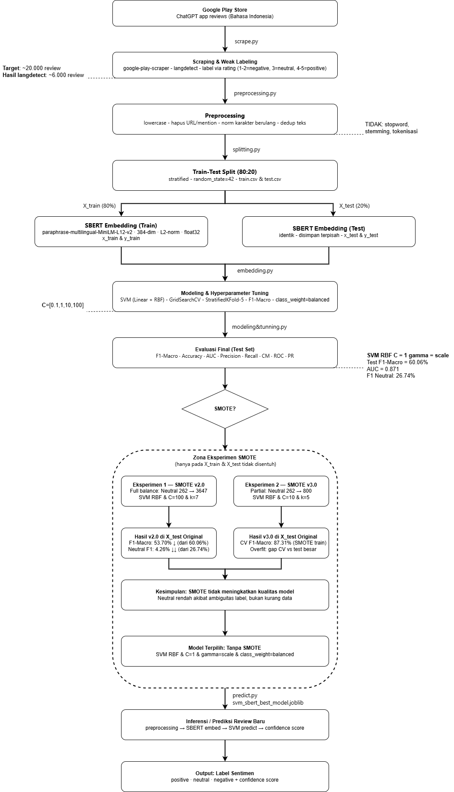

# Sentiment Analysis — ChatGPT Play Store Reviews (Bahasa Indonesia)

> **NoLimit Indonesia — Data Scientist Hiring Test**  
> Task: **Classification** — Sentiment Analysis menggunakan Hugging Face Sentence Transformers + SVM

---

## Daftar Isi

- [Compliance dengan Hiring Test](#compliance-dengan-hiring-test)
- [Gambaran Proyek](#gambaran-proyek)
- [Dataset](#dataset)
- [Arsitektur Pipeline](#arsitektur-pipeline)
- [Flowchart Pipeline](#flowchart-pipeline)
- [Model & Teknologi](#model--teknologi)
- [Hasil Evaluasi](#hasil-evaluasi)
- [Contoh Prediksi](#contoh-prediksi)
- [Eksperimen SMOTE](#eksperimen-smote)
- [Struktur Folder](#struktur-folder)
- [Setup & Instalasi](#setup--instalasi)
- [Cara Menjalankan](#cara-menjalankan)
- [Output yang Dihasilkan](#output-yang-dihasilkan)
- [Keputusan Teknis](#keputusan-teknis)
- [Referensi](#referensi)

---

## Compliance dengan Hiring Test

| Requirement | Status | Detail |
|---|---|---|
| Hugging Face model | ✅ | SBERT `paraphrase-multilingual-MiniLM-L12-v2` |
| Embedding-based representation | ✅ | SBERT embeddings (384-dim, L2-norm, float32) |
| Classification task | ✅ | Sentiment Analysis (positive / neutral / negative) |
| README | ✅ | File ini |
| Dataset source & annotation | ✅ | Google Play Store + weak labeling via rating |
| Flowchart end-to-end pipeline | ✅ | `flowchart.png` (lihat bagian [Flowchart Pipeline](#flowchart-pipeline)) |
| Runnable scripts | ✅ | `scrape.py` → `predict.py` (7 step berurutan) |
| Sample input dataset | ✅ | `data/sample_data.csv` |
| Prediction examples | ✅ | Lihat bagian [Contoh Prediksi](#contoh-prediksi) |
| `requirements.txt` | ✅ | Tersedia di root repo |

---

## Gambaran Proyek

Proyek ini membangun sistem **sentiment analysis** untuk review aplikasi ChatGPT di Google Play Store berbahasa Indonesia. Sistem mengklasifikasikan review ke dalam tiga kelas: **positive**, **neutral**, dan **negative**.

Pipeline menggunakan pendekatan:
1. **Sentence-BERT (SBERT)** dari Hugging Face sebagai feature extractor (embedding 384-dimensi)
2. **Support Vector Machine (SVM)** sebagai classifier
3. **GridSearchCV + StratifiedKFold** untuk hyperparameter tuning tanpa data leakage
4. **Eksperimen SMOTE** untuk menangani class imbalance (dua iterasi, keduanya dievaluasi secara jujur)

---

## Dataset

| Atribut | Detail |
|---|---|
| **Sumber** | Google Play Store — Aplikasi ChatGPT (`com.openai.chatgpt`) |
| **Cara pengumpulan** | Scraping menggunakan library `google-play-scraper` |
| **Filter bahasa** | Hanya Bahasa Indonesia (dideteksi dengan `langdetect`) |
| **Target scraping** | ~20.000 review mentah |
| **Setelah filter langdetect** | ~6.000 review lolos filter Indonesia |
| **Setelah preprocessing** | ~5.993 review bersih |
| **Periode** | Review terbaru (`Sort.NEWEST`) |

### Lisensi Dataset

Review berasal dari Google Play Store dan digunakan hanya untuk keperluan edukasi, penelitian, dan evaluasi teknis hiring test. Tidak ada data pribadi pengguna yang disimpan selain teks review publik yang tersedia secara terbuka.

### Labeling

Menggunakan **weak labeling** berbasis rating bintang:

| Rating | Label |
|---|---|
| ⭐ 1–2 | `negative` |
| ⭐⭐⭐ 3 | `neutral` |
| ⭐⭐⭐⭐–⭐⭐⭐⭐⭐ 4–5 | `positive` |

### Distribusi Kelas (setelah preprocessing)

| Kelas | Train (80%) | Test (20%) |
|---|---|---|
| Positive | ~76.1% | ~76.1% |
| Negative | ~18.5% | ~18.5% |
| Neutral | ~5.4% | ~5.4% |

> Dataset bersifat **imbalanced** (dominan positive). Ditangani dengan `class_weight='balanced'` pada SVM, bukan oversampling (setelah eksperimen SMOTE terbukti tidak meningkatkan performa — lihat [Eksperimen SMOTE](#eksperimen-smote)).

---

## Arsitektur Pipeline

```
Google Play Store (com.openai.chatgpt)
          │
          ▼  scrape.py
┌─────────────────────────┐
│   Scraping & Weak Label │  langdetect filter · label via rating
└─────────────────────────┘
          │
          ▼  preprocessing.py
┌─────────────────────────┐
│      Preprocessing      │  lowercase · hapus URL/mention
│                         │  norm karakter berulang · dedup teks
└─────────────────────────┘
          │
          ▼  spliting.py
┌─────────────────────────┐
│  Train-Test Split 80:20 │  stratified · random_state=42
└─────────────────────────┘
       │           │
   X_train      X_test (tidak disentuh sampai evaluasi final)
       │
       ▼  embedding.py
┌─────────────────────────┐
│    SBERT Embedding      │  paraphrase-multilingual-MiniLM-L12-v2
│                         │  384-dim · L2-norm · float32
└─────────────────────────┘
       │
       ▼  modeling_tunning.py
┌─────────────────────────┐
│  Modeling & Tuning v1.0 │  SVM (Linear + RBF) · GridSearchCV
│                         │  StratifiedKFold-5 · F1-Macro
└─────────────────────────┘
       │
       ▼  evaluasi.py
┌─────────────────────────┐
│   Evaluasi Final Test   │  F1-Macro=60.06% · AUC=0.8717
│   (sekali, tidak diulang│  Confusion Matrix · ROC · PR Curve
└─────────────────────────┘
       │
       │ [F1 Neutral rendah → eksperimen SMOTE]
       │
       ▼  [Zona Eksperimen SMOTE — hanya X_train]
┌─────────────────────────────────────────────┐
│  Eks. 1 — SMOTE v2.0 (Full Balance)         │
│  Neutral 262→3647 · SVM RBF C=100 · k=7    │
│  Hasil: F1-Macro 53.70% ↓ · Neutral 4.26% ↓│
├─────────────────────────────────────────────┤
│  Eks. 2 — SMOTE v3.0 (Partial)             │
│  Neutral 262→800 · SVM RBF C=10 · k=5      │
│  Hasil: CV F1-Macro 87.31% (SMOTE data)    │
│         Overfit besar di X_test original    │
└─────────────────────────────────────────────┘
       │
       │ Kesimpulan: SMOTE tidak meningkatkan kualitas
       │ → kembali ke v1.0 (tanpa SMOTE)
       │
       ▼  predict.py
┌─────────────────────────┐
│  Inferensi Review Baru  │  preprocessing → SBERT → SVM
│                         │  confidence score · low_confidence flag
└─────────────────────────┘
          │
          ▼
   output/sample_predictions.csv
   (positive · neutral · negative + confidence)
```

---

## Flowchart Pipeline

Flowchart end-to-end pipeline tersedia di file `flowchart.png` pada root repo.



Flowchart mencakup seluruh tahap dari scraping hingga inferensi, termasuk zona eksperimen SMOTE dan keputusan model final.

---

## Model & Teknologi

### Embedding Model (Hugging Face)

| Atribut | Detail |
|---|---|
| **Model** | [`paraphrase-multilingual-MiniLM-L12-v2`](https://huggingface.co/sentence-transformers/paraphrase-multilingual-MiniLM-L12-v2) |
| **Library** | `sentence-transformers` (Hugging Face) |
| **Dimensi output** | 384 |
| **Bahasa** | Multilingual (termasuk Bahasa Indonesia) |
| **Normalisasi** | L2-normalization (unit vector, norm=1.0) |
| **dtype** | float32 |
| **Seed** | 42 (reproducible) |

> 🔗 Hugging Face Model Hub: https://huggingface.co/sentence-transformers/paraphrase-multilingual-MiniLM-L12-v2

Model ini dipilih karena:
- Support Bahasa Indonesia secara native
- Ringan dan cepat dibandingkan model 768-dim (seperti IndoBERT)
- Digunakan luas dalam riset NLP Indonesia
- L2-normalized output sangat kompatibel dengan Linear SVM

### Classifier

| Atribut | Detail |
|---|---|
| **Algoritma** | Support Vector Machine (SVC) |
| **Kernel terbaik** | RBF (Radial Basis Function) |
| **C** | 1 |
| **gamma** | `scale` (= 1 / (n_features × X.var())) |
| **class_weight** | `balanced` |
| **probability** | `True` (Platt Scaling) |
| **Tuning** | GridSearchCV — C=[0.1,1,10,100], kernel=[linear,rbf], StratifiedKFold-5 |
| **Metrik tuning** | F1-Macro |

---

## Hasil Evaluasi

Evaluasi dilakukan **satu kali** pada test set yang benar-benar terpisah (tidak pernah disentuh selama training/tuning).

### Metrik Utama (v1.0 — Model Terpilih)

| Metrik | Nilai |
|---|---|
| **F1-Macro** | **60.06%** |
| F1-Weighted | 80.45% |
| Accuracy | 78.57% |
| AUC-Macro | **0.8717** |

### F1 Per Kelas

| Kelas | F1 | Precision | Recall | Support |
|---|---|---|---|---|
| Negative | 65.54% | — | — | 222 |
| Neutral | 26.74% | — | — | 65 |
| Positive | 87.91% | — | — | 912 |

> **Catatan:** F1 Neutral yang rendah (26.74%) disebabkan oleh ambiguitas label — review bintang 3 tidak selalu benar-benar "netral" secara semantik. Eksperimen SMOTE dilakukan untuk mengatasi ini, namun terbukti tidak membantu (lihat bagian berikutnya).

### Visualisasi Evaluasi

Dashboard evaluasi dan confusion matrix tersedia di folder `output/`:

| File | Deskripsi |
|---|---|
| `viz_eval_summary_dashboard.png` | Dashboard ringkasan seluruh metrik |
| `viz_eval_confusion_matrix.png` | Confusion matrix |
| `viz_eval_roc_multiclass.png` | ROC curve per kelas |
| `viz_eval_pr_curve.png` | Precision-Recall curve |

---

## Contoh Prediksi

Berikut contoh output nyata dari `predict.py`:

### Contoh 1 — Positive

```
Input   : "Aplikasi sangat membantu pekerjaan saya sehari-hari"

prediction  : positive
confidence  : 0.92
conf_positive  : 0.92
conf_negative  : 0.05
conf_neutral   : 0.03
low_confidence : False
```

### Contoh 2 — Negative

```
Input   : "Kadang error dan tidak bisa login, sangat mengganggu sekali"

prediction  : negative
confidence  : 0.88
conf_positive  : 0.07
conf_negative  : 0.88
conf_neutral   : 0.05
low_confidence : False
```

### Contoh 3 — Neutral (Low Confidence)

```
Input   : "Biasa saja, tidak ada yang spesial dari aplikasi ini"

prediction  : neutral
confidence  : 0.47
conf_positive  : 0.31
conf_negative  : 0.22
conf_neutral   : 0.47
low_confidence : True
```

> **Catatan:** `low_confidence = True` muncul ketika model tidak cukup yakin (confidence < 0.50). Hal ini wajar untuk kelas neutral karena ambiguitas semantik label rating bintang 3.

Untuk menjalankan prediksi sendiri, lihat [Step 7 — Prediksi Review Baru](#step-7--prediksi-review-baru).

---

## Eksperimen SMOTE

Setelah evaluasi v1.0 menunjukkan F1 Neutral yang rendah, dilakukan dua eksperimen SMOTE **hanya pada X_train** (X_test tidak pernah disentuh).

### Eksperimen 1 — SMOTE v2.0 (Full Balance)

| Parameter | Detail |
|---|---|
| Strategi | Full balance — Neutral 262 → 3.647 |
| k_neighbors | 7 |
| Model | SVM RBF C=100 |

**Hasil di X_test Original (imbalanced):**

| Metrik | v1.0 | v2.0 | Gain |
|---|---|---|---|
| F1-Macro | 60.06% | 53.70% | **-6.36% ↓** |
| F1 Neutral | 26.74% | 4.26% | **-22.48% ↓↓** |
| Accuracy | 78.57% | 82.49% | +3.92% |

### Eksperimen 2 — SMOTE v3.0 (Partial)

| Parameter | Detail |
|---|---|
| Strategi | Partial — Neutral 262 → 800 (3.1×) |
| k_neighbors | 5 |
| Model | SVM RBF C=10 |

**Hasil:**

| Metrik | v1.0 Test | v3.0 CV (SMOTE data) |
|---|---|---|
| F1-Macro | 60.06% | 87.31% (CV) |
| F1 Neutral | 26.74% | 88.36% (CV) |

> CV score 87.31% diukur pada data yang sudah di-SMOTE (seimbang). Gap besar antara CV dan test set original menunjukkan **overfitting** — model hanya mengenali synthetic data, bukan pola nyata.

### Kesimpulan Eksperimen

Kedua eksperimen SMOTE tidak berhasil meningkatkan performa di data real. **Model terpilih adalah v1.0 (tanpa SMOTE)** dengan `class_weight='balanced'`.

Rendahnya F1 Neutral lebih disebabkan **ambiguitas semantik label** (rating 3 tidak selalu mencerminkan sentimen netral secara linguistik), bukan kekurangan data minoritas.

---

## Struktur Folder

```
nolimit-ds-test-<name>/
│
├── src/
│   │
│   ├── data/
│   │   ├── sample_data.csv               ← Input prediksi (review contoh)
│   │   ├── raw_reviews.csv               ← Hasil scraping mentah
│   │   ├── train.csv                     ← Hasil split 80%
│   │   ├── test.csv                      ← Hasil split 20%
│   │   ├── X_train_emb.npy               ← SBERT embedding train (N×384, float32)
│   │   ├── X_test_emb.npy                ← SBERT embedding test  (N×384, float32)
│   │   ├── y_train.npy                   ← Label train (int)
│   │   ├── y_test.npy                    ← Label test  (int)
│   │   ├── label_classes.npy             ← ['negative', 'neutral', 'positive']
│   │   ├── svm_sbert_baseline_model.joblib
│   │   ├── svm_sbert_best_model.joblib   ← Model terpilih (v1.0)
│   │   └── svm_sbert_tuning_results.csv
│   │
│   ├── output/                           ← Hasil evaluasi model v1.0
│   │   ├── svm_sbert_best_model.joblib
│   │   ├── sample_predictions.csv        ← Hasil prediksi + confidence
│   │   ├── eval_classification_report.txt
│   │   ├── eval_metrics_summary.csv
│   │   ├── evaluation_final_log.txt
│   │   ├── modeling_tuning_svm_sbert_log.txt
│   │   ├── svm_sbert_tuning_results.csv
│   │   ├── viz_eval_summary_dashboard.png   ← UNGGULAN
│   │   ├── viz_eval_confusion_matrix.png
│   │   ├── viz_eval_roc_multiclass.png
│   │   ├── viz_eval_pr_curve.png
│   │   ├── viz_eval_calibration.png
│   │   ├── viz_eval_confidence_dist.png
│   │   ├── viz_eval_cv_vs_test_gap.png
│   │   ├── viz_eval_error_analysis.png
│   │   ├── viz_eval_per_class_metrics.png
│   │   └── ... (visualisasi tuning lainnya)
│   │
│   ├── outputSmoteV2/                    ← Hasil eksperimen SMOTE v2.0 (Full Balance)
│   │   ├── smote_eval_summary_dashboard.png
│   │   ├── smote_eval_confusion_matrix.png
│   │   ├── viz_smote_eval_v1_vs_v2_test.png ← Perbandingan v1 vs v2
│   │   └── ... (log, model, visualisasi lainnya)
│   │
│   ├── outputSmote/                      ← Hasil eksperimen SMOTE v3.0 (Partial)
│   │   ├── v3_eval_summary_dashboard.png
│   │   ├── v3_eval_confusion_matrix.png
│   │   ├── viz_v3_eval_3versions_comparison.png ← Perbandingan v1, v2, v3
│   │   └── ... (log, model, visualisasi lainnya)
│   │
│   ├── playstore_reviews_chatgpt.csv     ← Output scrape.py (setelah filter langdetect)
│   ├── preprocessed_reviews.csv          ← Output preprocessing.py
│   ├── scrape.py                         ← Step 1: Scraping & weak labeling
│   ├── preprocessing.py                  ← Step 2: Text cleaning & dedup
│   ├── spliting.py                       ← Step 3: Train-test split stratified
│   ├── embedding.py                      ← Step 4: SBERT feature extraction
│   ├── modeling&tunning.py               ← Step 5: SVM baseline + GridSearchCV
│   ├── evaluasi.py                       ← Step 6: Evaluasi final test set
│   ├── predict.py                        ← Step 7: Inferensi review baru
│   ├── modeling&tunningSMOTE.py          ← Eksperimen SMOTE (opsional)
│   └── evaluasiSMOTE.py                  ← Evaluasi eksperimen SMOTE (opsional)
│
├── app.py                   ← Streamlit demo app
├── flowchart.png            ← Flowchart end-to-end pipeline (MANDATORY)
├── requirements.txt
└── README.md
```

---

## Setup & Instalasi

### Prasyarat

- Python 3.8+
- pip

### Instalasi dependensi

```bash
pip install -r requirements.txt
```

> **Catatan:** Model SBERT (`paraphrase-multilingual-MiniLM-L12-v2`) akan otomatis diunduh dari Hugging Face saat `embedding.py` pertama kali dijalankan (~120MB). Pastikan koneksi internet tersedia.

---

## Cara Menjalankan

Jalankan script secara berurutan. Setiap script menyimpan output yang dibutuhkan script berikutnya.

### Step 1 — Scraping

```bash
python scrape.py
```

Output: `playstore_reviews_chatgpt.csv`

### Step 2 — Preprocessing

```bash
python preprocessing.py
```

Output: `preprocessed_reviews.csv`

### Step 3 — Train-Test Split

```bash
python spliting.py
```

Output: `data/train.csv`, `data/test.csv`

### Step 4 — SBERT Embedding

```bash
python embedding.py
```

Output: `data/X_train_emb.npy`, `data/X_test_emb.npy`, `data/y_train.npy`, `data/y_test.npy`, `data/label_classes.npy`

> Proses ini membutuhkan waktu beberapa menit tergantung hardware (CPU/GPU).

### Step 5 — Modeling & Tuning

```bash
python modeling_tunning.py
```

Output: `output/svm_sbert_best_model.joblib`, `output/svm_sbert_tuning_results.csv`, berbagai visualisasi PNG

### Step 6 — Evaluasi Final

```bash
python evaluasi.py
```

Output: `output/eval_classification_report.txt`, `output/eval_metrics_summary.csv`, 9 visualisasi evaluasi

### Step 7 — Prediksi Review Baru

Siapkan file `data/sample_data.csv` dengan kolom `review`:

```csv
review
Aplikasinya sangat membantu pekerjaan saya sehari-hari
Kadang error dan tidak bisa login, sangat mengganggu
Biasa saja, tidak ada yang spesial
Luar biasa! AI terbaik yang pernah saya coba
Boros baterai dan memori HP jadi penuh
```

Lalu jalankan:

```bash
python predict.py
```

Output: `output/sample_predictions.csv`

---

## Output yang Dihasilkan

### `output/sample_predictions.csv`

| Kolom | Deskripsi |
|---|---|
| `id` | Nomor urut prediksi |
| `review_original` | Teks review asli (sebelum cleaning) |
| `review_clean` | Teks setelah preprocessing |
| `word_count` | Jumlah kata setelah cleaning |
| `prediction` | Label sentimen: `positive` / `neutral` / `negative` |
| `confidence` | Max probability (keyakinan model, 0–1) |
| `conf_negative` | Probabilitas kelas negative |
| `conf_neutral` | Probabilitas kelas neutral |
| `conf_positive` | Probabilitas kelas positive |
| `low_confidence` | `True` jika confidence < 0.50 |
| `short_review` | `True` jika review < 3 kata |
| `prediction_time` | Timestamp saat prediksi dijalankan |

---

## Keputusan Teknis

### Mengapa SBERT dan bukan TF-IDF?

SBERT menghasilkan representasi **semantik** — dua kalimat dengan makna sama akan memiliki embedding yang berdekatan meskipun menggunakan kata berbeda. TF-IDF hanya menangkap kesamaan leksikal.

### Mengapa SVM dan bukan model deep learning?

- Dataset ~6.000 review → ukuran moderat, SVM sangat efektif
- SBERT sudah meng-encode kompleksitas semantik dalam representasinya
- SVM dengan L2-normalized dense embedding terbukti mendekati performa BERT fine-tuning untuk klasifikasi teks pendek
- Interpretable, deterministik, dan lebih ringan untuk deployment

### Mengapa tidak dilakukan stopword removal / stemming?

SBERT adalah model berbasis transformer yang sudah memahami konteks penuh kalimat. Stopword removal atau stemming justru akan **merusak representasi semantik** yang dipelajari model dari konteks kalimat lengkap.

### Mengapa F1-Macro sebagai metrik utama?

Dataset imbalanced (76% positive). Accuracy akan bias ke kelas mayoritas. F1-Macro merata-ratakan F1 ketiga kelas secara adil sehingga performa pada kelas minoritas (neutral, negative) ikut diperhitungkan.

### Mengapa X_test tidak disentuh saat tuning?

Membocorkan X_test ke proses tuning adalah **data leakage** — hasil evaluasi tidak lagi mencerminkan performa di dunia nyata. StratifiedKFold CV pada X_train sudah cukup untuk memilih hyperparameter terbaik. X_test digunakan **hanya sekali** di tahap evaluasi final.

---

## Referensi

- Reimers & Gurevych (2019). *Sentence-BERT: Sentence Embeddings using Siamese BERT-Networks.* EMNLP 2019.
- Wainer & Fonseca (2021). *Nested cross-validation when selecting classifiers is overzealous for most practical applications.*
- Hastie, Tibshirani & Friedman (2009). *The Elements of Statistical Learning.*
- scikit-learn documentation — *Practical notes on SVM parameters.*
- Hugging Face Model Hub — [`paraphrase-multilingual-MiniLM-L12-v2`](https://huggingface.co/sentence-transformers/paraphrase-multilingual-MiniLM-L12-v2)

---

*Submitted for NoLimit Indonesia Data Scientist Hiring Test.*
